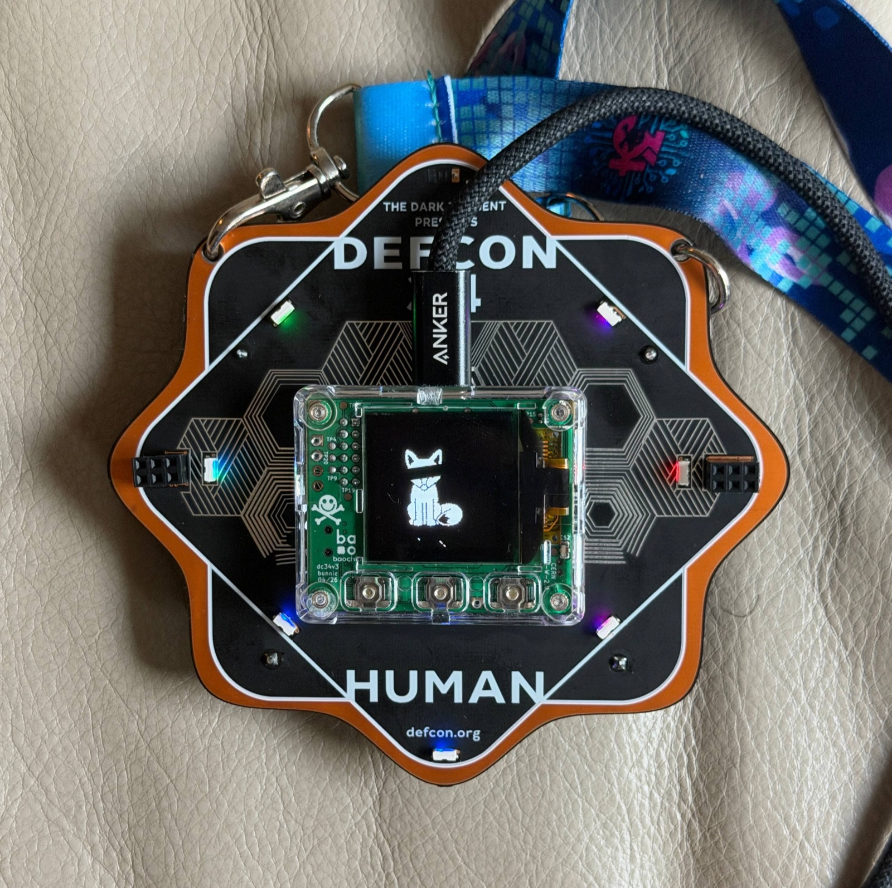
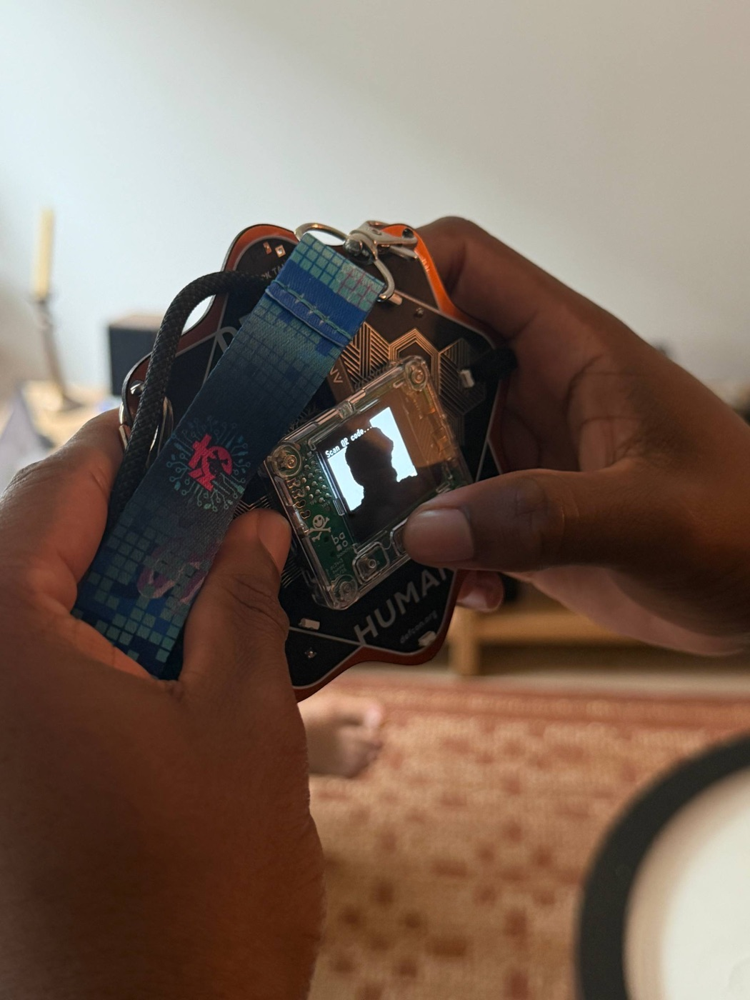

<div align="center">

# DEFCON / CAMERA

### Turn your DEF CON badge into a camera.

<br/>
<sub>The DEF CON 34 badge in camera mode — LED ring lit, a shot developing on the OLED.</sub>

<p align="center">
  <a href="https://defcon-polaroid.vercel.app"></a>
  
  
  
  
</p>

</div>

> The **badge side** of a hack that turns the DEF CON 34 badge's camera into a polaroid camera:
> firmware that adds a photo command + LED show, and a host bridge that streams shots to a
> [live wall](#the-gallery). Press the button, and your shot develops on the wall in seconds.

* * *

## Why I built this

Every badge was doing the same two things: **scanning QR codes and blinking lights.** The DEF CON
social ritual is a slow QR handshake — line up the cameras, wait for the scan to catch, *then* you've
"met."

But there's a **real camera** in there, and everyone was using it as a barcode reader. I wanted to be
faster and do what nobody else was: point it at a person, press a button, done. **Turn the scanner
into a camera.**

**The hack in one line:** the badge was already grabbing camera frames (to find QR codes) and throwing
them away — so I added a "take a photo" command that dumps a frame back out over the **serial console
the firmware was already logging to** (as hex text), plus a laptop bridge (`capture.py`) that catches
it and posts it to a live wall. No new hardware path — just reuse the channel that was already open.

* * *

## How it works

<div align="center">
  
</div>

The badge runs **[Xous](https://github.com/betrusted-io/xous-core)**, a microkernel OS where each piece
of hardware is owned by a **service**, and services talk by passing **opcodes** (numbered messages). One
capture, five steps:

1. **Trigger** — camera button, or `test photo` on the console.
2. **Message** — sends the `CapturePhoto` opcode to `bao-video` (the camera service).
3. **Dump** — `bao-video` prints the frame as `PHOTOSTART w h` / `PHOTO <hex>` / `PHOTOEND`, downsampled 2×.
4. **Bridge** — `capture.py` reassembles + sharpens it and uploads the PNG (auto-reconnecting).
5. **Wall** — the gallery stores it and AI-upscales it, so a 128×120 grab looks sharp.

The `PHOTOSTART`/`PHOTOEND` markers make the stream self-syncing, and a `MOTION_PAUSE` flag freezes the
LEDs during a capture so glare doesn't wreck the shot.

* * *

## Quickstart

**1 · Get the firmware** — our edits in [`firmware/`](./firmware) are diffs on the upstream repos:

```bash
git clone https://github.com/bunnie/dc34-console
git clone https://github.com/bunnie/dc34-api
git clone -b dev https://github.com/betrusted-io/xous-core
# then copy firmware/dc34/* over the matching paths in the clones
```

**2 · Build** the UF2s (`loader.uf2`, `xous.uf2`, `apps.uf2`):

```bash
cd xous-core && cargo xtask install-toolkit
cd ../dc34-console && cargo build --release --target riscv32imac-unknown-xous-elf \
  --features board-baosec,oem-baosec-lite,bao1x,utralib/bao1x,misc-test
cd ../xous-core && cargo xtask baosec-lite \
  ../dc34-console/target/riscv32imac-unknown-xous-elf/release/dc34-console~flash \
  ../dc34-vault/target/riscv32imac-unknown-xous-elf/release/dc34-vault
```

> ⚠️ `cargo xtask …` runs build code from the cloned `xous-core` repo — only run it if you trust the source.

**3 · Flash (boot mode)** — the badge's `boot1` bootloader mounts a USB drive named **`BAOCHIP`**; you
just copy the UF2s onto it (works on macOS, Windows, Linux).

> ⚠️ **Batteries must be OUT** — with them in, the badge reboots into normal Xous and never enters boot mode.

The dance: batteries out + unplug (~10s) → hold the button nearest USB-C → plug in while holding (~5s)
→ a `BAOCHIP` drive appears. Copy `loader.uf2`, `xous.uf2`, `apps.uf2` onto it (drag-and-drop), then
eject. First flash needs all three; later, just `apps.uf2`.

<details>
<summary>Per-OS drive/port + command line + boot-mode photo</summary>

| OS | Boot mode (drive `BAOCHIP`) | Booted normal Xous (serial) |
|----|------------------------------|------------------------------|
| **macOS** | `/Volumes/BAOCHIP` | `/dev/cu.usbmodem…` |
| **Windows** | a new drive letter (e.g. `D:`) in File Explorer | a **COM** port in Device Manager |
| **Linux** | `/media/<you>/BAOCHIP` | `/dev/ttyACM…` |

```bash
# macOS / Linux
cp loader.uf2 xous.uf2 apps.uf2 /Volumes/BAOCHIP/ && sync
```
```powershell
# Windows (PowerShell) — replace D: with the BAOCHIP drive letter
Copy-Item loader.uf2, xous.uf2, apps.uf2 D:\
```

Entry can be finicky — use a short **data** USB-C cable and retry. The ROM bootloader is always there,
so a bad flash is recoverable, not a brick.

<div align="center">
<br/>
<sub><b>Shot to take:</b> the <code>BAOCHIP</code> drive on your computer with the badge plugged in.</sub>
</div>
<!-- Replace the src with assets/boot-mode.png -->

</details>

**4 · Run the bridge** — plug the badge in over a **data** USB-C cable:

```bash
python3 -m pip install pyserial Pillow certifi
GALLERY_URL=https://your-gallery.example python3 capture.py
```

Auto-detects the port on macOS; on Windows/Linux set `BADGE_PORT` (`COM3` / `/dev/ttyACM0`).

<details>
<summary>Windows (PowerShell), env vars, always-on</summary>

```powershell
python -m pip install pyserial Pillow certifi
$env:GALLERY_URL = "https://your-gallery.example"
python capture.py
```

| Env var | Purpose |
|---------|---------|
| `GALLERY_URL` | Where to upload (default `http://localhost:3000`). |
| `BADGE_PORT` | Serial port — required on Windows/Linux (`COM3`, `/dev/ttyACM0`). |
| `BADGE_UPLOAD_TOKEN` | Must match the gallery's `UPLOAD_TOKEN`, if set. |

Always-on: macOS → the launchd config in [`deploy/`](./deploy), Windows → Task Scheduler, Linux →
a systemd user service.

</details>

**5 · Shoot** — press the badge's **camera button** (or `test photo`). The LEDs freeze, the frame
streams over serial, and it lands on your [gallery wall](#the-gallery).

<div align="center">
<br/>
<sub>Point it at a person, press the button — the shot lands on the OLED, then the wall.</sub>
</div>

* * *

<details>
<summary><b>What changed in the firmware</b></summary>

**Camera** — a new `GfxOpcode::CapturePhoto`, wired end to end:

- `ux-api/src/service/api.rs` — added the `CapturePhoto` opcode.
- `dc34-console/src/cmds/test.rs` — `test photo` sends `CapturePhoto` to the video service.
- `xous-core/services/bao-video/src/main.rs` — streams one settled frame (downsampled 2×) as
  `PHOTOSTART / PHOTO <hex> / PHOTOEND` over serial — exactly what `capture.py` parses.
- `bao1x-hal/src/gc2145/gc2145.rs` — GC2145 sensor bring-up.

**Lights** — a custom LED show:

- `dc34-console/src/leds.rs` — registers the LED server and drives the `Lightgenes` generative animation.
- `dc34-console/src/motion.rs` — a dot races the ring, then it flashes, on repeat, and a `MOTION_PAUSE`
  flag freezes the LEDs during a capture.

<div align="center">
<br/>
<sub><b>Shot to take:</b> the LED ring mid-show — the racing dot / rainbow chase (a gif is even better).</sub>
</div>
<!-- Replace the src with assets/leds.gif or assets/leds.png -->

</details>

<details>
<summary><b>Camera &amp; tuning</b> — resolution, 800×600, video, LED speed</summary>

**Sensor & resolution.** The badge uses a **GalaxyCore GC2145** — 2 MP, native **1600×1200 (UXGA @
15 fps)**, also **800×600 (SVGA @ 30 fps)** and smaller
([datasheet](https://e2e.ti.com/cfs-file/__key/communityserver-discussions-components-files/968/GC2145-CSP-DataSheet-release-V1.0_5F00_20131201.pdf),
[Linux driver](https://codebrowser.dev/linux/linux/drivers/media/i2c/gc2145.c.html)). The firmware runs
it small on purpose: initialized at 320×240, cropped to 256×240, then **downsampled 2× → 128×120
grayscale** for the serial dump — small keeps RAM low and the dump fast.

**Getting 800×600.** SVGA is a native mode and `gc2145.rs` already windows down from 1600×1200 via
`set_resolution`. Add a `Resolution::Res800x600`, bump `IMAGE_WIDTH/HEIGHT` + the frame buffer +
`set_slicing`, and drop the 2× downsample. Cost: ~25× the pixels → a much bigger frame buffer and a much
slower serial dump. `capture.py` already handles any size.

**Video?** Not really — the sensor can, but the transport can't. A 128×120 frame is ~30 KB of hex text;
at 115200 baud that's a couple seconds per frame, so streaming over the log is well under 1 fps —
timelapse, not video. Real video needs a binary USB transport or on-device recording.

**Why it looks sharp.** The grab is tiny; the resolution is manufactured downstream — `capture.py`
upscales to ≥512 px (LANCZOS + unsharp), and the gallery adds a Cloudinary `e_gen_restore` AI restore
(swap via `CLOUDINARY_DISPLAY_TX`).

**LED speed.** Live: `test rate <0-255>` (the `Lightgenes` mutation rate, no reflash). In firmware:
`motion.rs` sets the base tempo (*"~80 ms per color flip"*) + `cd_rate` / `hue_ratedir` in `cmds/test.rs`.

</details>

<details>
<summary><b>Design notes</b> — why it's shaped this way</summary>

- **Constraints first.** No wifi, tiny RAM, slow serial, an un-brickable ROM bootloader — the design
  falls out of these before any code.
- **Reuse the channel, don't build one.** The image rides the log stream that was already flowing.
- **Speak the system's grammar.** A new capability is always: add an opcode, send it, handle it.
- **Respect boundaries you can't see.** Sharing the accelerometer with the LEDs broke sleep/wake, so the
  LED driver stays "LEDs only."
- **Spend resource where it's cheap.** Capture small on the badge, manufacture resolution downstream.
- **Design for the failure path.** Self-syncing markers + a reconnecting bridge assume desync and
  disconnect, not hope against them.

</details>

## The gallery

The web wall is its own project — **[defcon-polaroid](https://github.com/ivoinestrachan/defcon-polaroid)**
(live at [defcon-polaroid.vercel.app](https://defcon-polaroid.vercel.app)): a Next.js app that stores
shots in Cloudinary / Vercel Blob and renders the polaroid wall. Deploy your own and point `GALLERY_URL`
at it.

## Acknowledgements & license

Built on **[bunnie Huang](https://github.com/bunnie)** (DC34 badge apps), **[betrusted-io](https://github.com/betrusted-io)**
(Xous + `bao1x` HAL), and **[Baochip](https://github.com/baochip)**. The bridge and docs here are free to
use; the firmware in [`firmware/`](./firmware) inherits its upstream projects' licenses.
