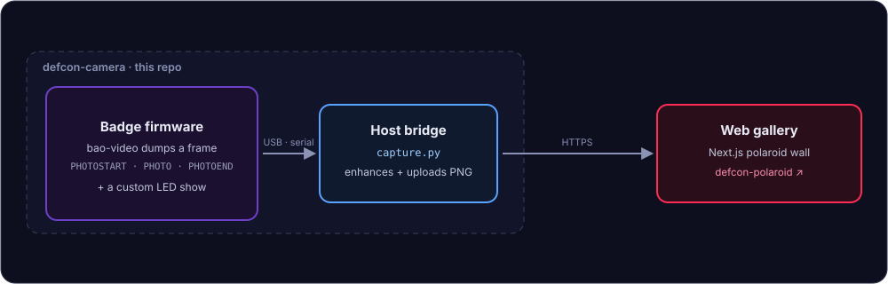

<div align="center">

# DEFCON / CAMERA

### Turn your DEF CON badge into a camera.

<br/>
<sub><b>Shot to take:</b> the badge in-hand with its LED ring lit + a few 1-bit prints fanned beside it (a short gif of a photo developing on the wall is even better).</sub>
<!-- Replace the src above with assets/hero.png or assets/hero.gif once you've taken it. -->

<p align="center">
  <a href="https://defcon-polaroid.vercel.app"></a>
  
  
  
</p>

</div>

> **Point the badge, press the camera button, and watch your shot develop onto the wall.** This repo
> is the **badge side** — the firmware edits that add a camera + a custom LED show, plus the host
> bridge that streams shots off the badge. The web gallery is a separate project (see
> [The gallery](#the-gallery)).

* * *

## Why I built this

Everyone's badge was doing the same two things: **scanning QR codes and blinking lights.** The whole
social ritual at DEF CON is a slow QR handshake — find someone, line up the cameras, wait for the scan
to catch, *then* you've "met." Everyone doing the exact same dance.

But there's a **real camera** in the badge, and the only thing anyone pointed it at was a QR code.
Nobody was taking *photos* — all that hardware used as a barcode reader. I didn't want to scan people's
codes; it's slow, and it's what everyone else was already doing. I wanted to be **faster**, and I wanted
the camera to do something nobody was using it for: point it at a person, press a button, done.
**Turn the scanner into a camera.**

### How I hacked it

The badge was already *seeing* — it just never *kept* anything. So the hack was about getting a picture
off it:

- Got onto the badge's **serial console** and poked at the firmware directly.
- Found the camera was already running: `bao-video` pulled frames off the sensor constantly, but only
  to find **QR finder patterns** and draw a viewfinder. The pixels sat in a buffer, then got thrown away.
- Added a **"take a photo"** command that grabs one of those frames and **dumps it back out over the
  same serial console** the firmware was already logging to (hex text, framed `PHOTOSTART … PHOTOEND`) —
  no new hardware path, just reusing the channel that was already open.
- Wrote a laptop-side bridge (`capture.py`) that catches the dump, rebuilds the image, cleans it up,
  and throws it onto a **live photo wall**.
- Made the LEDs mine too, and froze them during a capture so glare wouldn't wreck the shot.

Press the button → your face develops onto the wall in a couple seconds. No handshake, no waiting for a
scan. The fastest camera in the room.

* * *

## Overview

<div align="center">
  
</div>

| Path | What it is |
|------|-----------|
| [`firmware/`](./firmware) | Our badge firmware edits — camera capture + the LED show. |
| [`capture.py`](./capture.py) | Host bridge: reads a frame off serial, sharpens it, uploads it to the gallery. |
| [`deploy/`](./deploy) | launchd config to keep the bridge always-on (macOS). |
| **Gallery** | A separate project — see [The gallery](#the-gallery). |

* * *

## How it works

The badge runs **[Xous](https://github.com/betrusted-io/xous-core)**, a microkernel OS: every piece of
hardware is owned by an independent **service**, and services talk by passing **opcodes** (numbered
messages) — nothing shares memory, you send a message and a service reacts. Three services matter here:
`bao-video` (owns the camera), the LED server (owns the ring), and `dc34-console` (a shell you reach
over serial).

**The key move:** the badge *already* streams text over USB — its log/console. So instead of building a
new USB transport to move image bytes (hard), the photo is emitted as hex **text** through the existing
log (`log::info!`). A transport problem became an encoding problem, because encoding was free and
transport was expensive.

A photo then flows in five steps:

1. **Trigger** — the camera button, or `test photo` on the console.
2. **Message** — that sends the `CapturePhoto` opcode (added to the shared `ux-api`) to `bao-video`.
3. **Dump** — `bao-video` grabs the next settled frame and prints `PHOTOSTART w h` / `PHOTO <hex>` /
   `PHOTOEND`, downsampled 2× so it's small enough to be fast.
4. **Bridge** — `capture.py` reads the serial stream, reassembles the frame, enhances it, and uploads
   the PNG (reconnecting when the USB-CDC port glitches).
5. **Wall** — the gallery stores it and AI-upscales it, so a 128×120 grab looks sharp.

The `PHOTOSTART`/`PHOTOEND` markers make the stream **self-synchronizing** — join mid-frame or drop a
line and the parser just waits for the next `PHOTOSTART`. And because the LEDs and camera share a few
centimeters of air, a `MOTION_PAUSE` flag **freezes the ring during a capture** so glare doesn't pollute
the frame — the software says "independent," the physics says "coupled."

* * *

## Step-by-step

### 1 · Get the firmware

Our edits in [`firmware/`](./firmware) are diffs on top of these upstream repos — clone them side by side:

```bash
git clone https://github.com/bunnie/dc34-console
git clone https://github.com/bunnie/dc34-api
git clone -b dev https://github.com/betrusted-io/xous-core
```

Then copy our modified files from [`firmware/dc34/`](./firmware/dc34) over the matching paths in the clones.

### 2 · Build

```bash
cd xous-core && cargo xtask install-toolkit          # installs the riscv32imac-unknown-xous-elf toolchain
cd ../dc34-console && cargo build --release \
  --target riscv32imac-unknown-xous-elf \
  --features board-baosec --features oem-baosec-lite --features bao1x --features utralib/bao1x \
  --features misc-test                               # enables the `test photo` command
cd ../xous-core && cargo xtask baosec-lite \
  ../dc34-console/target/riscv32imac-unknown-xous-elf/release/dc34-console~flash \
  ../dc34-vault/target/riscv32imac-unknown-xous-elf/release/dc34-vault
```

This produces `loader.uf2`, `xous.uf2`, and `apps.uf2`.

> ⚠️ `cargo xtask …` runs build tooling from the cloned `xous-core` repo — only run it if you trust
> the source you cloned.

### 3 · Enter boot mode & flash

Flashing goes through the badge's **boot mode** — the `boot1` ROM bootloader — which exposes a USB
drive named **`BAOCHIP`** over the same USB-C port. This works the same on macOS, Windows, and Linux:
you just copy files onto that drive.

> ⚠️ **Batteries must be OUT.** With batteries in, the PMIC stays latched and the badge reboots
> straight into normal Xous on every replug — you'll never reach boot mode.

**The "bootloader dance":**

1. Remove the batteries and unplug the badge. Wait ~10s until it's fully off (screen dark).
2. Press and hold the button nearest the USB-C port — hold firmly.
3. Plug in the USB-C cable while still holding, and keep holding ~4–5s.
4. A USB drive named **`BAOCHIP`** appears → you're in boot mode.

If instead you only get a **serial device** (and no `BAOCHIP` drive), it booted normal Xous — redo the
dance. Where things show up per OS:

| OS | Boot mode (a drive named `BAOCHIP`) | Booted normal Xous instead (serial) |
|----|--------------------------------------|--------------------------------------|
| **macOS** | `/Volumes/BAOCHIP` (and Finder) | `/dev/cu.usbmodem…` |
| **Windows** | a new drive letter (e.g. `D:` / `E:`) in File Explorer | a **COM** port in Device Manager |
| **Linux** | `/media/<you>/BAOCHIP` or `/run/media/…` | `/dev/ttyACM…` |

**Flash** by copying the UF2 files onto the `BAOCHIP` drive — drag-and-drop in Finder / File Explorer
works everywhere. First flash: copy **all three** (`loader.uf2`, `xous.uf2`, `apps.uf2`). Later updates:
if the loader/kernel are unchanged, just `apps.uf2`.

Command-line equivalents:

```bash
# macOS / Linux (use your actual mount path on Linux)
cp loader.uf2 xous.uf2 apps.uf2 /Volumes/BAOCHIP/ && sync
```

```powershell
# Windows (PowerShell) — replace D: with the BAOCHIP drive letter
Copy-Item loader.uf2, xous.uf2, apps.uf2 D:\
```

Then eject / "safely remove" the drive before it reboots. To boot **normally** afterwards: batteries
in, plug USB, and don't hold any button. Entry can be finicky — use a short **data** USB-C cable and
retry. The ROM bootloader is always reachable, so a bad flash is recoverable, **not** a brick.

<div align="center">
<br/>
<sub><b>Shot to take:</b> the <code>BAOCHIP</code> drive showing up on your computer with the badge plugged in — proof it's in boot mode.</sub>
</div>
<!-- Replace the src with assets/boot-mode.png -->

### 4 · Run the bridge

Connect the badge over a **data** USB-C cable, install the deps, and run `capture.py` — point
`GALLERY_URL` at your deployed gallery.

```bash
# macOS / Linux
python3 -m pip install pyserial Pillow certifi
GALLERY_URL=https://your-gallery.example python3 capture.py
```

```powershell
# Windows (PowerShell)
python -m pip install pyserial Pillow certifi
$env:GALLERY_URL = "https://your-gallery.example"
python capture.py
```

The bridge auto-detects the badge's serial port on macOS. On **Windows and Linux, set `BADGE_PORT`
explicitly**:

| OS | `BADGE_PORT` example |
|----|----------------------|
| macOS | `/dev/cu.usbmodemXXXX` (auto-detected) |
| Linux | `/dev/ttyACM0` |
| Windows | `COM3` (check Device Manager) |

| Env var | Purpose |
|---------|---------|
| `GALLERY_URL` | Where to upload (default `http://localhost:3000`). |
| `BADGE_PORT` | Serial port — required on Windows/Linux. |
| `BADGE_UPLOAD_TOKEN` | Must match the gallery's `UPLOAD_TOKEN`, if set. |

To keep the bridge always-on: macOS → the launchd config in [`deploy/`](./deploy) (edit the paths +
`GALLERY_URL` first); Windows → Task Scheduler; Linux → a systemd user service.

### 5 · Shoot

Press the badge's **camera button** (or run `test photo` on the badge console). The LEDs freeze, a
frame streams over serial, `capture.py` uploads it, and it lands on your gallery wall.

<div align="center">
<br/>
<sub><b>Shot to take:</b> a grid of a few 1-bit photos the badge actually took — screenshot the gallery wall, or drop in the PNGs.</sub>
</div>
<!-- Replace the src with assets/samples.png -->

* * *

## What we changed

**Camera** — a new `GfxOpcode::CapturePhoto`, wired end to end:

- `ux-api/src/service/api.rs` — added the `CapturePhoto` opcode.
- `dc34-console/src/cmds/test.rs` — `test photo` sends `CapturePhoto` to the video service.
- `xous-core/services/bao-video/src/main.rs` — streams one settled frame (downsampled 2×) as
  `PHOTOSTART / PHOTO <hex> / PHOTOEND` over serial — exactly what `capture.py` parses.
- `bao1x-hal/src/gc2145/gc2145.rs` — GC2145 sensor bring-up.

**Lights** — a custom LED show:

- `dc34-console/src/leds.rs` — registers the LED server and drives the `Lightgenes` generative animation.
- `dc34-console/src/motion.rs` — a dot races the ring, then it flashes, on repeat; a `MOTION_PAUSE`
  flag **freezes the LEDs during a capture** so glare doesn't pollute the frame.

<div align="center">
<br/>
<sub><b>Shot to take:</b> the LED ring mid-show — the racing dot / rainbow chase (a gif is even better).</sub>
</div>
<!-- Replace the src with assets/leds.gif or assets/leds.png -->

## Camera & tuning

### Resolution

The badge's sensor is a **GalaxyCore GC2145** — a 2 MP CMOS sensor (1616×1232 pixel array) with a
native **1600×1200 (UXGA @ 15 fps)** mode that also outputs **800×600 (SVGA @ 30 fps)**, VGA, and
smaller. See the [official datasheet](https://e2e.ti.com/cfs-file/__key/communityserver-discussions-components-files/968/GC2145-CSP-DataSheet-release-V1.0_5F00_20131201.pdf)
and the [Linux kernel driver](https://codebrowser.dev/linux/linux/drivers/media/i2c/gc2145.c.html) (which enumerates the modes).

Today the firmware runs it **small on purpose**, for speed and RAM:

- The sensor is initialized at **320×240**, then center-cropped to **256×240** (`IMAGE_WIDTH × IMAGE_HEIGHT` in `bao-video/src/main.rs`).
- On capture it's **downsampled 2× → 128×120 grayscale** and streamed as hex over the serial log (`PHOTOSTART / PHOTO / PHOTOEND`).

That tiny size keeps the on-chip frame buffer small and the serial dump fast.

**Can you get 800×600?** Yes — SVGA is a native GC2145 mode, and the driver
(`bao1x-hal/src/gc2145/gc2145.rs`) already windows/subsamples down from the 1600×1200 array via
`set_resolution(w, h)`. Roughly what it takes:

1. Add a `Resolution::Res800x600` variant (bao1x-api camera enum) and select it in `cam.init(...)`.
2. Bump `IMAGE_WIDTH` / `IMAGE_HEIGHT`, the `frame` buffer, and the `set_slicing(...)` crop in `bao-video`.
3. Drop the 2× downsample in the PHOTO dump (or keep it for a 400×300 shot).

Trade-offs: 800×600 is ~25× the pixels of 128×120, so the frame buffer (RAM/IFRAM) grows a lot and
each serial dump takes much longer. `capture.py` already handles any frame size, so the host side
needs no changes.

### Can it record video?

Sort of — but not really, and it's the serial channel's fault, not the sensor's. The GC2145 does 30 fps
and `bao-video` already grabs frames continuously, so the badge can *see* video fine. The bottleneck is
**getting frames off the badge**: a single 128×120 frame is ~30 KB of hex text, and at 115200 baud
that's a couple seconds per frame — so streaming over the log tops out well under 1 fps. That's a
**choppy timelapse / stop-motion**, not smooth video.

Real video would mean a **faster transport** — binary USB (CDC/bulk) instead of hex-over-log — or
recording to on-device storage and offloading later. Both are real projects, not tweaks. As built:
bursts and timelapses yes, smooth video no.

### How the "resolution thing" works on the website

The native grab is tiny, so the **sharp, big photos on the wall come from the host + gallery**, not
the sensor:

1. **`capture.py`** center-crops to square, autocontrasts, **upscales to ≥512 px with LANCZOS**, and
   unsharp-masks — turning a 128×120 frame into a clean 512 px PNG before upload.
2. **The gallery** applies an on-the-fly Cloudinary transform — `e_gen_restore,e_improve,e_sharpen:40,q_auto`
   (**AI restore + upscale**), swappable via the `CLOUDINARY_DISPLAY_TX` env var (`e_upscale` for AI
   super-res, or `""` for the raw upload).

So you get big, sharp-*looking* shots off a 128×120 grab. Bumping the on-badge resolution to 800×600
would give **real** detail instead of upscaled detail.

### LED animation speed

Two knobs:

- **Live, over serial:** `test rate <0-255>` sets the `Lightgenes` mutation rate — how fast the LED
  "genes" evolve. No reflash needed.
- **In firmware (rebuild):** `motion.rs` sets the base tempo — *"milliseconds per color flip; 80 ms is
  the proven-stable rate"* — alongside the `cd_rate` / `hue_ratedir` params in `cmds/test.rs`. Change
  and reflash to retune.

## Design notes

Why it's shaped the way it is:

- **Constraints first.** No wifi, tiny RAM, slow serial, an un-brickable ROM bootloader — the whole
  design falls out of these before any code gets written.
- **Reuse the channel, don't build one.** The image rides the log stream that was already flowing.
  Leverage over labor.
- **Speak the system's grammar.** A new capability is always: add an opcode, send it, handle it. Same
  recipe every time.
- **Respect boundaries you can't see.** Sharing the accelerometer with the LEDs broke sleep/wake —
  ownership is load-bearing, so the LED driver stays "LEDs only."
- **Spend resource where it's cheap.** Capture small on the badge; manufacture the resolution downstream
  where compute is abundant.
- **Design for the failure path.** Self-syncing frame markers and a bridge that reconnects — desync and
  disconnect are assumed, not hoped against.

## The gallery

The web wall is its own project — **[defcon-polaroid](https://github.com/ivoinestrachan/defcon-polaroid)**
(live at [defcon-polaroid.vercel.app](https://defcon-polaroid.vercel.app)). It's a Next.js app that
stores shots in Cloudinary / Vercel Blob and renders the polaroid wall with lightbox, download, and a
curate/delete mode. Deploy your own and point `GALLERY_URL` at it.

## Acknowledgements

Built on the work of **[bunnie Huang](https://github.com/bunnie)** (the DC34 badge apps), the
**[betrusted-io](https://github.com/betrusted-io)** team (**Xous OS** + `bao1x` HAL), and
**[Baochip](https://github.com/baochip)**.

## License

The bridge (`capture.py`) and docs here are free to use. The firmware in [`firmware/`](./firmware) is
**derived from the upstream repos above and remains under their respective licenses** — check each
project before redistributing.
